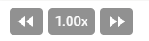

# Youtube Accelerator v1.1.0

In a hurry?

Customize the playback speed of Youtube Videos.

Supports up to 16x speed!

## Local Installation

1. Clone repository to folder of your choice
2. Open Google Chrome
3. Go to [chrome://extensions/](chrome://extensions/)
4. Enable Developer Mode
5. Click on Load Unpacked
6. Select repository folder
7. All done!

## Chrome Store Installation

Visit [Google's web store](https://chrome.google.com/webstore/detail/youtube-accelerator/ajobbbellhaokbfkgkcpapmbenlccokd) to add the extension to your browser.

## Component

The extension will be located in the video information bar

## Release History

### v1.1.0

- Component is added regardless of user journey on Youtube
- Added session storage support so that the playback speed persists after changing video
- Webpack build for Devs
- Code structure improvements

### v1.0.0

- Moved functionality from popup to component below video
- Component is added when opening video directly from URL
- Component is added when selecting video from home page

### v0.0.1

- Basic functionality implemented in popup
